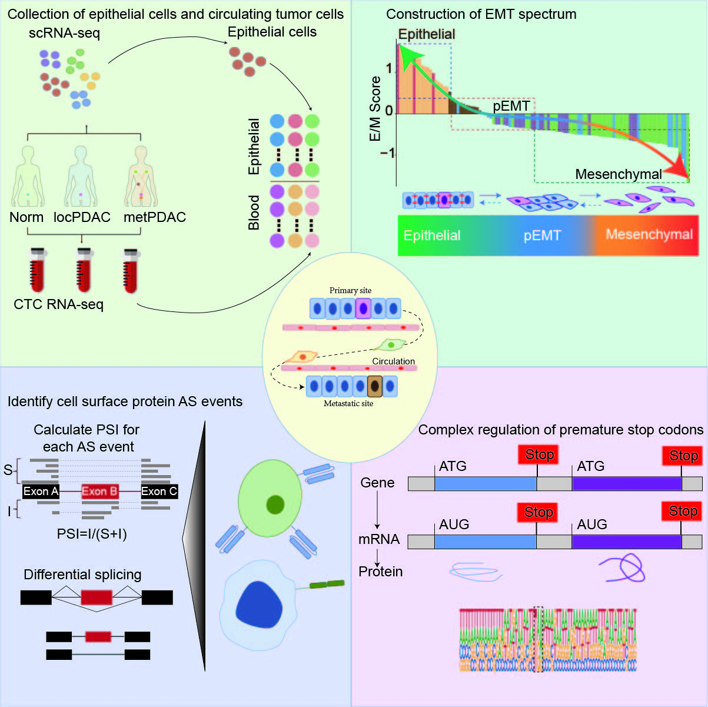

# Overview

Functional Requirement of Alternative Splicing in Epithelial-Mesenchymal Transition of Pancreatic Circulating Tumor Cells

# Code description

1. Integrated analysis of scRNA datasets

    Integrate single-cell datasets from articles based on filter criteria

2. cnv patient 

    Analysis of Single-Cell Copy Number Variations.We utilized the Bayesian segmentation approach CopyKat to compute the signal for copy number profiles from the gene expression matrix
3. cnv ms

    We excluded cells that were not predicted and the diploid cells that were predicted to be normal epithelial or immune cells. We calculated the mean square and the correlation of CNV per cell with the average of the top 5% of cells from the aneuploid single cells. This allowed us to detect cancer cells and enhance the precision of our findings. 

4. get epithelial cell

    Cells specifically with a mean square greater than 0.02 or a CNV correlation greater than 0.2, are categorized as malignant cancer cells.

5. Calculation of sample EMT scores

    An "E/M score" was calculated by taking the Log10 of the mean mRNA expression values for all the epithelial genes divided by all the mesenchymal genes: Log10(EPI/MES). 

6. EMT differential alternative splicing

    Analysis of differential alternative splicing among EMT groups.

7. AS allE DaseFinder

    Function to analyze alternative splicing events in all bam files.

8. AS func

    Function to analyze differential alternative splicing events in each type of alternative splicing. 

9. EMT differential AS mode identify

    Analysis of modality and premature stop codons in differential alternative splicing events.